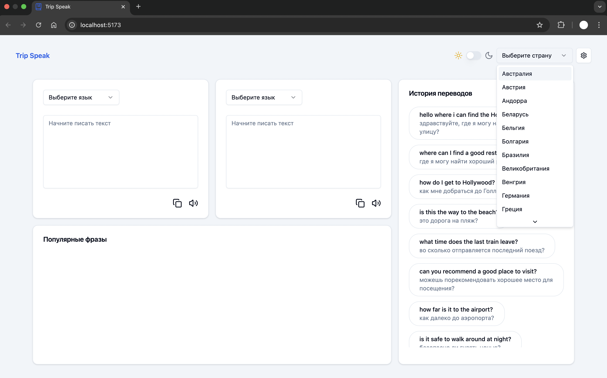
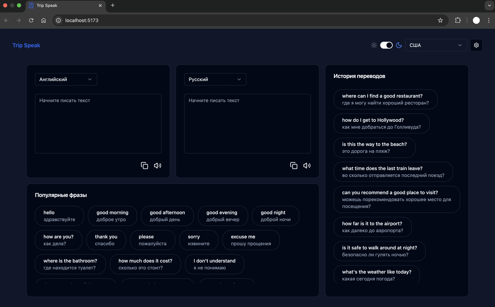
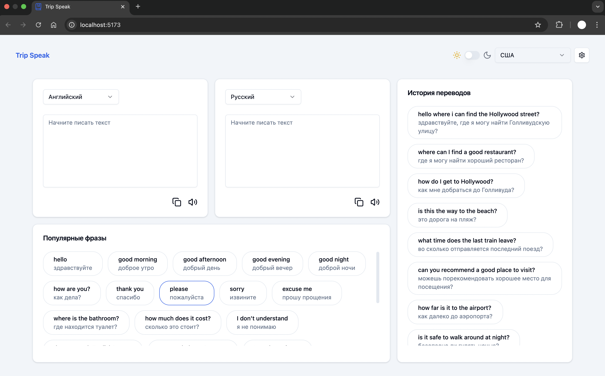
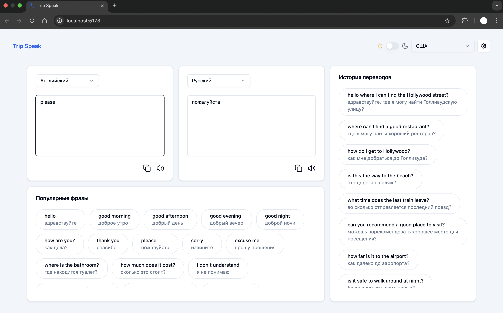
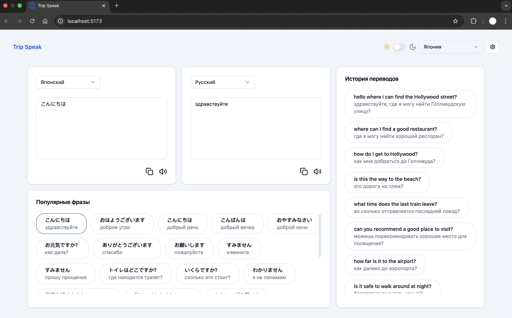

# Trip Speak

Trip Speak is a modern web application built with **React** and **Vite**, providing an intuitive and interactive way for travelers to communicate in different languages. The app utilizes state-of-the-art technologies and libraries such as **Radix UI**, **TanStack React Query**, **Zustand**, **ShadCN**, and **Tailwind CSS**, to offer a seamless user experience.

## Features

- **Language Translator**: Easily translate common phrases into different languages using OpenAI's API.
- **Dropdown Menus & Popovers**: Interactive UI elements powered by **Radix UI** components.
- **Custom Select & Switches**: Modern select dropdowns and toggle switches.
- **State Management**: Global state management with **Zustand**.
- **Responsive UI**: Built using **Tailwind CSS** for fast, responsive design.
- **ShadCN Integration**: UI components for building beautiful and accessible user interfaces.

## Technologies

- **React**: A JavaScript library for building user interfaces.
- **Vite**: A fast development build tool.
- **Radix UI**: A set of low-level UI primitives for building accessible, high-quality design systems.
- **ShadCN**: Beautiful and accessible UI components for React, used to enhance the app's design.
- **TanStack React Query**: A data-fetching library for fetching, caching, and syncing server data in React.
- **Zustand**: A small, fast, and scalable bearbones state management solution.
- **Tailwind CSS**: A utility-first CSS framework for creating responsive and customizable designs.
- **OpenAI API**: For language translation.

## Installation

To get started with the project, follow these steps:

1. Clone the repository:

   ```bash
   git clone https://github.com/yourusername/trip-speak.git
   cd trip-speak
   ```

2. Run:
    ```bash
    npm install
    npm run dev
    ```


## UI





